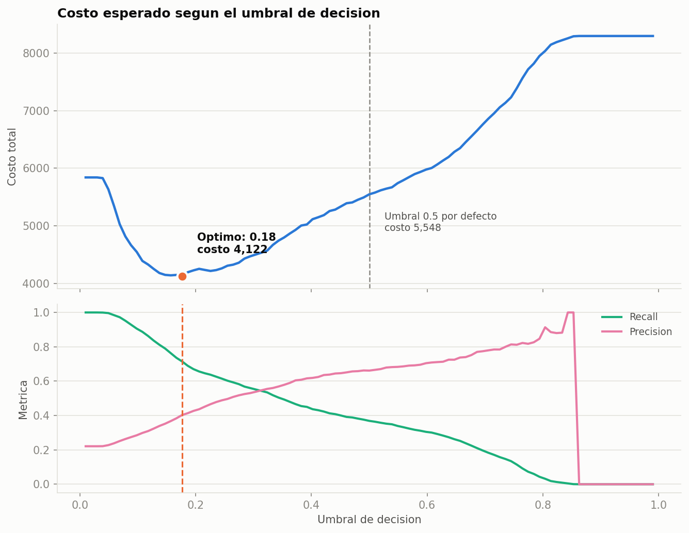
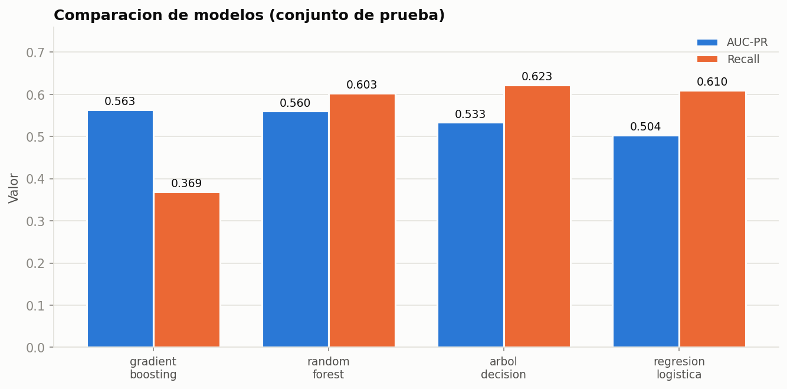
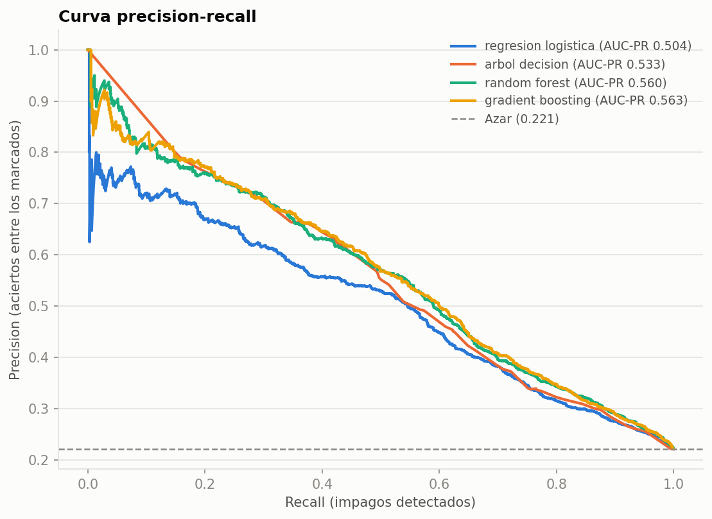
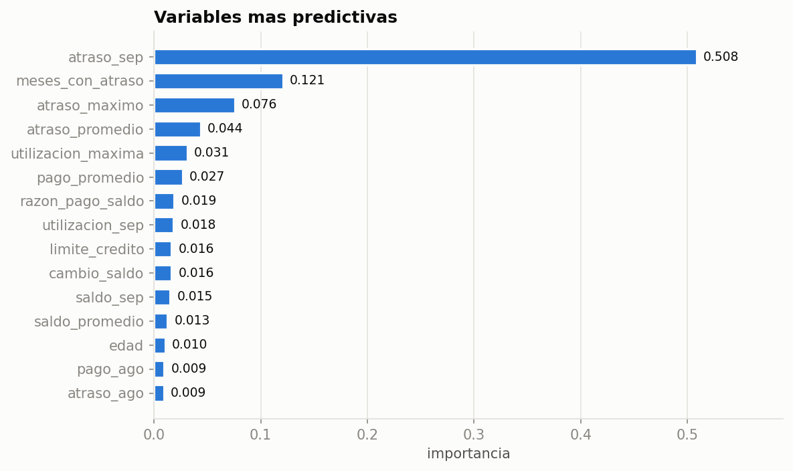

# Predicción de impago crediticio

Modelo de clasificación que estima la probabilidad de que un cliente de tarjeta de
crédito caiga en impago, con **análisis del umbral de decisión en términos de costo
de negocio**.

Dataset: [Default of Credit Card Clients](https://archive.ics.uci.edu/dataset/350/default+of+credit+card+clients)
(UCI) — 30,000 clientes reales de Taiwán, abril–septiembre 2005.

---

## El problema con la mayoría de los modelos de crédito

El 22.1% de los clientes cae en impago. Un modelo que prediga **"nadie cae en
impago"** —sin detectar un solo caso— alcanza **77.9% de exactitud**.

Por eso este proyecto no reporta accuracy como métrica principal. Reporta AUC-PR,
recall y, sobre todo, **el costo esperado en unidades de negocio**.

```
Modelo trivial ("nadie cae en impago"):
  exactitud .................. 0.7788
  recall ..................... 0.0000
  impagos no detectados ...... 1,659
```

---

## Resultado principal

El umbral de decisión por defecto (0.5) **no es el óptimo**. Los dos errores no
cuestan lo mismo: aprobar a alguien que no paga cuesta el saldo expuesto; rechazar
a alguien que sí habría pagado cuesta solo el margen.

Con una razón de costos conservadora de 1:5:

| Umbral | Costo total | Recall | Precisión |
|---|---|---|---|
| 0.50 (por defecto) | 5,548 | 0.369 | 0.662 |
| **0.18 (óptimo)** | **4,122** | **0.715** | 0.403 |

**Mover el umbral reduce el costo 25.7%** y casi duplica la detección de impagos
(de 37% a 71%), a cambio de más rechazos preventivos.



### ¿Y si el supuesto de costos está mal?

La razón 1:5 es un supuesto. El análisis de sensibilidad lo varía de 1:2 a 1:20:

| Razón de costos | Umbral óptimo | Recall | Precisión | Ahorro vs 0.5 |
|---|---|---|---|---|
| 1:2 | 0.32 | 0.535 | 0.555 | 6.3% |
| 1:3 | 0.26 | 0.593 | 0.508 | 13.8% |
| 1:5 | 0.18 | 0.715 | 0.403 | 25.7% |
| 1:10 | 0.08 | 0.952 | 0.263 | 51.6% |
| 1:20 | 0.07 | 0.972 | 0.252 | 73.1% |

**La conclusión es robusta:** en todo el rango evaluado el umbral óptimo está por
debajo de 0.5 y el ahorro es positivo. Lo que cambia es la magnitud, no la
dirección.

---

## Comparación de modelos

| Modelo | AUC-PR | ROC-AUC | Recall | Precisión | Exactitud |
|---|---|---|---|---|---|
| **Gradient Boosting** | **0.563** | 0.782 | 0.369 | 0.662 | 0.819 |
| Random Forest | 0.560 | 0.780 | 0.603 | 0.487 | 0.772 |
| Árbol de decisión | 0.533 | 0.765 | 0.623 | 0.454 | 0.751 |
| Regresión logística | 0.504 | 0.754 | 0.610 | 0.439 | 0.741 |



**Nota sobre la lectura:** Gradient Boosting gana en AUC-PR pero tiene el recall más
bajo al umbral 0.5 — precisamente porque ese umbral es inadecuado. Al reoptimizarlo
su recall sube a 0.715. Es la razón por la que comparar modelos solo al umbral por
defecto lleva a conclusiones equivocadas.



---

## Variables más predictivas



| Variable | Importancia |
|---|---|
| `atraso_sep` — estatus de pago del mes más reciente | 0.508 |
| `meses_con_atraso` — cuántos de 6 meses tuvo atraso | 0.121 |
| `atraso_maximo` | 0.076 |
| `atraso_promedio` | 0.044 |
| `utilizacion_maxima` — % del límite usado | 0.031 |

El comportamiento de pago reciente domina: `atraso_sep` sola explica la mitad de la
señal. Las variables demográficas (sexo, educación, estado civil) aparecen muy
abajo, lo cual es deseable — un modelo que decidiera crédito por sexo o edad sería
un problema regulatorio, no solo estadístico.

---

## Decisiones metodológicas

**Métrica principal: AUC-PR, no ROC-AUC ni accuracy.** Con 22% de positivos, la
curva precision-recall describe mejor el desempeño sobre la clase minoritaria. La
ROC puede verse bien mientras el modelo falla en lo que importa.

**Categorías no documentadas → "otro", no eliminadas.** El paper original documenta
`EDUCATION` 1–4 y `MARRIAGE` 1–3, pero los datos traen ceros y valores extra sin
significado declarado. Son ~1.5% de los registros; borrarlos introduciría sesgo de
selección.

**La escala de atraso no es lineal.** Los valores −2, −1 y 0 significan "sin
consumo", "pago total" y "crédito revolvente"; solo ≥1 es atraso real. Se conserva
el valor original y se deriva una variable de atraso efectivo.

**Preprocesamiento dentro del Pipeline.** El escalado y la imputación se ajustan
solo con los datos de entrenamiento en cada fold. Ajustarlos antes de separar
train/test filtraría información del test e inflaría las métricas.

**`class_weight="balanced"`.** Sin esto los modelos aprenden a predecir "paga" casi
siempre, porque el 78% de los casos lo son.

**Validación cruzada estratificada de 5 folds** sobre el conjunto de entrenamiento;
el de prueba (25%) se toca una sola vez, al final.

---

## Instalación y uso

```bash
git clone https://github.com/MoncerratAngeles/riesgo-credito-ml.git
cd riesgo-credito-ml

python3 -m venv .venv
source .venv/bin/activate          # Windows: .venv\Scripts\activate
pip install -r requirements.txt

PYTHONPATH=src python -m riesgo.pipeline
```

El dataset se descarga solo la primera vez desde UCI. La ejecución completa toma
~2 minutos.

Opciones:

```bash
python -m riesgo.pipeline --folds 3        # validación cruzada más rápida
python -m riesgo.pipeline --sin-graficas
python -m riesgo.pipeline -v
```

Pruebas:

```bash
python -m pytest tests/ -v                 # 13 pruebas
```

---

## Estructura

```
riesgo-credito-ml/
├── src/riesgo/
│   ├── config.py       Rutas, diccionario de variables, supuestos de costo
│   ├── datos.py        Descarga, limpieza y features derivadas
│   ├── modelos.py      Pipelines de sklearn y validación cruzada
│   ├── evaluacion.py   Métricas, análisis de costos y umbral óptimo
│   ├── viz.py          Figuras
│   └── pipeline.py     Orquestador con CLI
├── tests/              13 pruebas unitarias
├── notebooks/          Análisis exploratorio narrado
├── reports/            Tablas de resultados y figuras
└── models/             Modelo entrenado (.joblib)
```

## Salidas

| Archivo | Contenido |
|---|---|
| `reports/resumen.json` | Métricas principales del mejor modelo |
| `reports/comparacion_modelos.csv` | Tabla comparativa completa |
| `reports/barrido_umbrales.csv` | Costo y métricas en 101 umbrales |
| `reports/sensibilidad_costos.csv` | Umbral óptimo según la razón de costos |
| `reports/importancia_variables.csv` | Ranking de variables |
| `models/modelo_final.joblib` | Modelo entrenado, listo para predecir |

## Stack

Python · scikit-learn · Pandas · NumPy · Matplotlib · pytest

## Limitaciones

- Los datos son de Taiwán, 2005. Los patrones no trasladan directo al mercado
  mexicano actual; la metodología sí.
- La razón de costos 1:5 es un supuesto razonable, no un dato de la institución.
  El análisis de sensibilidad acota su efecto.
- No se evaluó equidad del modelo entre grupos demográficos (*fairness*). Es el
  siguiente paso natural antes de cualquier uso real.

## Fuente

Yeh, I. C., & Lien, C. H. (2009). *The comparisons of data mining techniques for
the predictive accuracy of probability of default of credit card clients*.
Expert Systems with Applications, 36(2), 2473–2480.

## Licencia

MIT
